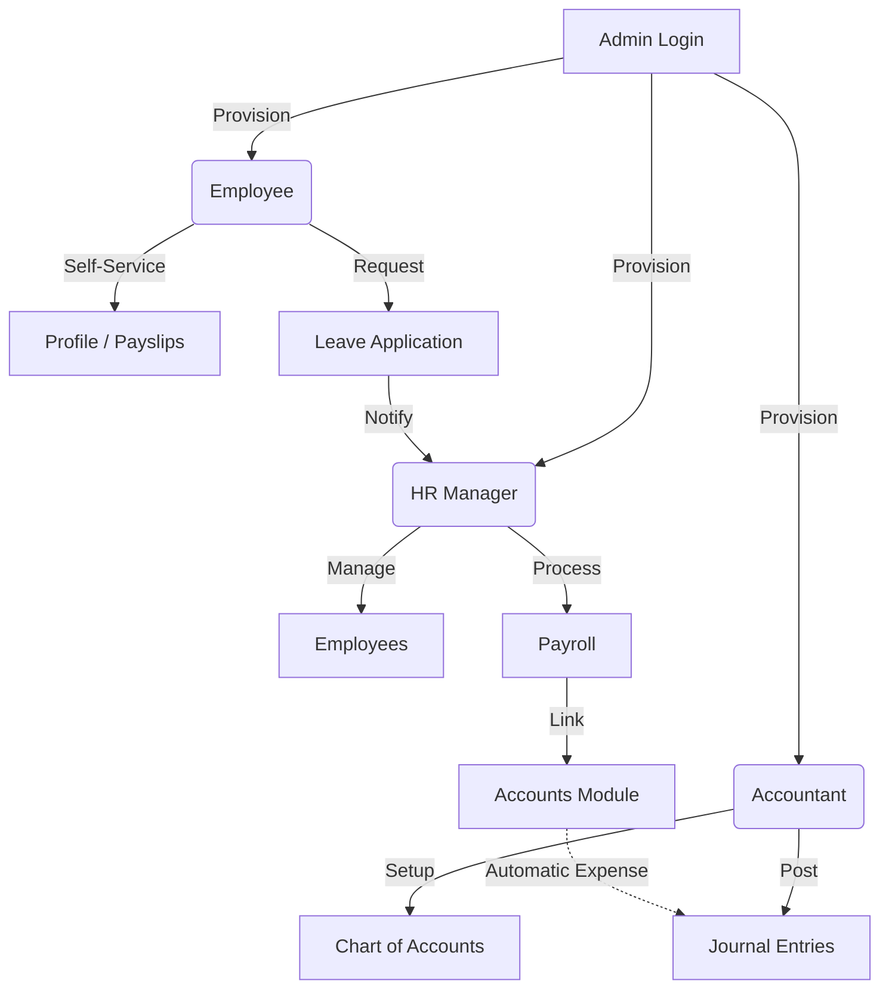

# 🚀 ERP Intelligence HQ

Welcome to the **ERP Intelligence HQ**, a high-fidelity, modular Enterprise Resource Planning system built for modern businesses. This platform features a sleek **"Clean Pro"** aesthetic with advanced role-based access control and integrated HR-Accountancy workflows.

---

## 🏗 System Architecture

The project follows a **Decoupled Full-Stack Architecture**:

- **Backend**: FastAPI (Python 3.12+) orchestrating asynchronous logic.
- **Database**: MongoDB Atlas (NoSQL) for flexible, scalable data storage.
- **Frontend**: React 18 + Vite with a custom design system and Lucide iconography.
- **Security**: JWT-based Authentication with strict Role-Based Access Control (RBAC).

---

## 🛠 Tech Stack

| Layer | Technology |
| :--- | :--- |
| **Server** | FastAPI, Uvicorn, Motor (Async MongoDB) |
| **Security** | PyJWT, Passlib (Bcrypt) |
| **Frontend** | React, Axios, React Router, Lucide-React |
| **Design** | Managed CSS Modules (Vanilla), Modern Radius System |
| **Env** | Dotenv (Backend), LocalStorage (Frontend Session) |

---

## 🔄 System Workflow & Modules

The system is designed with a **Root-First Access** philosophy.



### 1. Admin Control Gateway
The **Superuser** has absolute control. They manage the system roster, provision or revokes access, and can oversee both HR and Financial modules from a single command center.

### 2. HR & People Operations
- **Recruitment/Onboarding**: Add new employees with salary and department data.
- **Leave Management**: Unified dashboard to approve/reject staff leave requests.
- **Payroll Engine**: One-click monthly payroll generation that automatically syncs with the accounting ledger.

### 3. Financial Intelligence
- **Master Setup**: Configure Assets, Liabilities, and Expenses.
- **Transaction Ledger**: Real-time journal entry posting with automated balance tracking.
- **System Integration**: Payroll expenses from the HR module are automatically posted here to ensure financial accuracy.

---

## 🚦 Getting Started

### 1. Backend Setup
```bash
cd backend
# 1. Install dependencies
pip install -r requirements.txt

# 2. Configure Environment
# Create a .env file with:
# MONGODB_URL=mongodb+srv://...
# SECRET_KEY=your_secret
# PORT=8005

# 3. Launch Server
uvicorn main:app --reload --port 8005
```

### 2. Frontend Setup
```bash
cd frontend
# 1. Install dependencies
npm install

# 2. Launch Development Server
npm run dev
```

---

## 🔐 Default Access
- **Admin**: `admin@system.com` / `admin123`
- *Note: Only the Admin can create other user roles (HR, Accountant, Employee).*

---

## 📂 Project Structure
```text
.
├── backend/
│   ├── routers/        # HR and Accounting logic
│   ├── auth.py         # JWT and RBAC protection
│   ├── database.py     # MongoDB connection (Motor)
│   ├── main.py         # API Root and User Management
│   └── .env            # Private configuration
└── frontend/
    ├── src/
    │   ├── pages/      # Dashboards for all roles
    │   ├── App.jsx     # Strategic routing
    │   └── index.css   # Global "Clean Pro" design system
    └── .gitignore      # Repository protection
```

---

*Designed & Developed for High-Performance Enterprise Management.*
